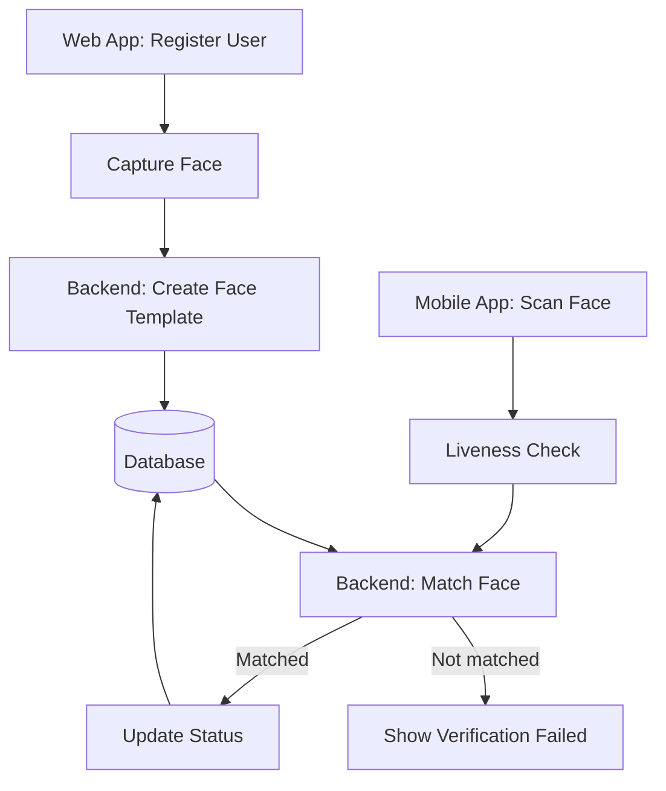

# FaceRead — Face Registration and Verification System

FaceRead is a face-based registration and status-verification platform. A user
registers through the web application, enrolls their face, and can later be
verified from a mobile application. After successful verification, the backend
updates the user's status in the database.

> **Project status:** The Python webcam capture prototype is available. The web
> application, mobile application, backend APIs, liveness detection, and
> database integration are planned components.

## Main Features

- Detect all connected cameras and let the operator select one.
- Display a circular guide for correct face positioning.
- Automatically capture one properly aligned and stable face.
- Display a green tick after successful capture.
- Save the cropped face image and capture metadata.
- Register users from a web application.
- Verify registered users from a mobile application.
- Update verification or attendance status in the database.
- Prevent duplicate status updates for the configured time period.

## Application Flow



1. An administrator or user completes registration in the web application.
2. The camera captures several consented face samples.
3. The backend converts the samples into a biometric face template.
4. The encrypted template is associated with the user in the database.
5. The mobile application captures a live face during verification.
6. A liveness check helps reject photographs, screens, or replay attempts.
7. The backend compares the live template with enrolled templates.
8. When the match score exceeds the configured threshold, the database status
   is updated and the mobile application displays a green tick.

## Proposed Components

| Component | Responsibility |
| --- | --- |
| Web application | User registration, consent, face enrollment and administration |
| Mobile application | Camera preview, liveness capture and verification result |
| Backend API | Authentication, enrollment, matching and status updates |
| Face service | Detection, image-quality checks, templates and similarity matching |
| Database | Users, encrypted templates, verification events and audit records |
| Object storage | Optional encrypted source images with a short retention period |

## Current Python Webcam Prototype

The `webcam_face_capture.py` program:

- scans connected cameras at startup;
- displays a camera selection menu;
- shows a circular face guide;
- waits until exactly one face is aligned and stable;
- captures the face automatically;
- saves images in `face_data/`; and
- writes metadata to `face_data/faces.csv`.

### Requirements

- Python 3.10 or newer
- A connected webcam
- Camera permission enabled for Python

Install OpenCV:

```bash
python -m pip install opencv-python==4.12.0.88
```

Optional on Windows: install `pygrabber` to display actual camera device names:

```bash
python -m pip install pygrabber
```

Run the application:

```bash
python webcam_face_capture.py
```

Controls:

| Key | Action |
| --- | --- |
| `Q` or `Esc` | Close the application |
| `R` | Reset capture state |

## Suggested API Design

### Register a user

```http
POST /api/v1/users
Content-Type: application/json
Authorization: Bearer <token>

{
  "externalId": "EMP-1001",
  "name": "Sample User",
  "email": "user@example.com",
  "biometricConsent": true
}
```

### Enroll a face

```http
POST /api/v1/users/{userId}/face-enrollment
Content-Type: multipart/form-data
Authorization: Bearer <token>

faceImages=<three-or-more-live-images>
```

Example response:

```json
{
  "userId": "8c018538-51ae-4f96-83d5-f128a7281f64",
  "enrollmentStatus": "ENROLLED",
  "qualityScore": 0.94
}
```

### Verify a face and update status

```http
POST /api/v1/face-verifications
Content-Type: multipart/form-data
Authorization: Bearer <mobile-token>

faceImage=<live-image>
deviceId=MOBILE-01
latitude=28.6139
longitude=77.2090
```

Example response:

```json
{
  "verificationId": "1ee80909-0af6-40b9-a0fd-467c3ff92d53",
  "matched": true,
  "userId": "8c018538-51ae-4f96-83d5-f128a7281f64",
  "matchScore": 0.91,
  "status": "PRESENT",
  "recordedAt": "2026-09-15T09:30:00Z"
}
```

The backend must calculate the match result. The client must never be allowed
to submit `matched=true` or directly update attendance/status.

## Suggested Database Model

### `users`

| Column | Type | Purpose |
| --- | --- | --- |
| `id` | UUID | Internal user identifier |
| `external_id` | VARCHAR | Employee, student or member identifier |
| `name` | VARCHAR | Display name |
| `email` | VARCHAR | Unique email address |
| `biometric_consent_at` | TIMESTAMP | Time consent was recorded |
| `enrollment_status` | VARCHAR | Pending, enrolled, revoked or failed |
| `created_at` | TIMESTAMP | Registration time |

### `face_templates`

| Column | Type | Purpose |
| --- | --- | --- |
| `id` | UUID | Template identifier |
| `user_id` | UUID | Owner of the template |
| `encrypted_template` | BYTEA | Encrypted biometric representation |
| `model_version` | VARCHAR | Model that generated the template |
| `quality_score` | DECIMAL | Enrollment quality measurement |
| `created_at` | TIMESTAMP | Enrollment time |
| `revoked_at` | TIMESTAMP | Template revocation time |

### `verification_events`

| Column | Type | Purpose |
| --- | --- | --- |
| `id` | UUID | Verification event identifier |
| `user_id` | UUID | Matched user, or null when unmatched |
| `device_id` | VARCHAR | Registered scanning device |
| `match_score` | DECIMAL | Server-calculated similarity score |
| `liveness_score` | DECIMAL | Server-calculated liveness score |
| `result` | VARCHAR | Matched, rejected, duplicate or error |
| `created_at` | TIMESTAMP | Verification time |

### `user_status_events`

| Column | Type | Purpose |
| --- | --- | --- |
| `id` | UUID | Status event identifier |
| `user_id` | UUID | Verified user |
| `verification_id` | UUID | Supporting verification event |
| `status` | VARCHAR | For example, present, checked-in or verified |
| `recorded_at` | TIMESTAMP | Server-generated event time |

Use a database constraint or idempotency key to prevent accidental duplicate
status events.

## Recommended Repository Structure

```text
face-read/
├── backend/
│   ├── api/
│   ├── face-service/
│   └── database/
├── web-app/
├── mobile-app/
├── python-camera/
│   └── webcam_face_capture.py
├── docs/
├── .env.example
└── README.md
```

## Security and Privacy

Face templates are sensitive biometric data. A production implementation
should:

- obtain clear consent before enrollment;
- provide a method to revoke consent and delete biometric data;
- encrypt templates in transit and at rest;
- store templates separately from general profile data;
- use short-lived access tokens and role-based authorization;
- add liveness detection before matching;
- keep an audit trail without logging raw biometric data;
- avoid storing source photos unless genuinely required;
- define retention and automatic-deletion policies;
- rate-limit verification attempts; and
- complete security, privacy and applicable legal reviews before deployment.

Do not rely on this prototype alone for authentication, payments, access to
sensitive systems, or other high-risk decisions.

## Roadmap

- [x] Webcam detection and camera selection
- [x] Circular alignment and automatic capture
- [x] Green-tick capture confirmation
- [ ] Web registration application
- [ ] Backend enrollment and verification APIs
- [ ] Mobile scanning application
- [ ] Liveness detection
- [ ] Encrypted face-template storage
- [ ] Database status updates and duplicate prevention
- [ ] Admin dashboard and audit reporting
- [ ] Automated tests and deployment pipeline

## License

Give credit to sumit.co.in that's all <3 
